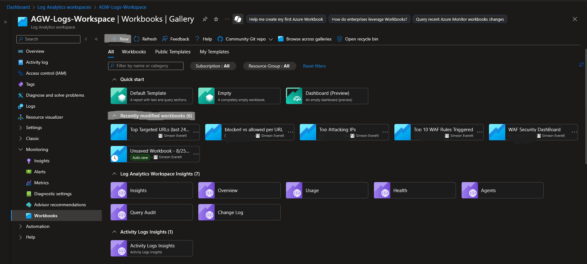
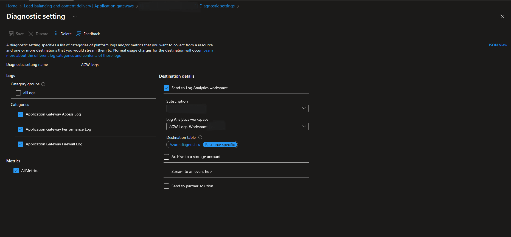

# azure-waf-logging-analytics-dashboard
Built a custom Azure WAF monitoring solution leveraging Log Analytics, Workbooks, and dashboards to visualize web traffic and security events.
---
This project demonstrates how to set up Azure Application Gateway with Web Application Firewall (WAF) and integrate it with Log Analytics, Workbooks, and Dashboards for monitoring real-world web traffic and security events.

---

---

🚀 Project Overview

Built a custom Azure WAF monitoring solution leveraging:

Deployable ARM template for Azure Application Gateway (WAF v2) with built-in traffic inspection and protection.

Log Analytics Workspace to collect and query diagnostic logs.

Workbooks & Dashboards to visualize key metrics such as:

Top targeted URLs

Top client IPs

Allowed vs. blocked requests

Top 10 WAF rules triggered

Blocked requests over time

---
Getting Started 
 
Step 1.
Deployable ARM template for Azure Application Gateway (WAF v2) with built-in traffic inspection and protection.
[View the ARM Template](azure-application-gateway-arm-template)
 
 
1. Go to the Azure Portal → Create a resource → search “Template deployment (deploy using custom templates)” → Create.

2. On Custom deployment, choose Build your own template in the editor → Load file → upload your template.json.

3. Click Save.

4. Fill in:

        Subscription, Resource group (create one if needed).

        Region (must match or be valid for AGW).

        Parameters (paste External IDs or use the defaults if you left placeholders).

5. Review + create → Create.

6. Watch notifications for deployment status; click the Deployment to see details.

Post-deploy checks (Portal):

  Resource Group → Application Gateways → select your gateway. Confirm:

        Status = Running

        Frontend public IP is assigned

        Backend health shows Healthy for the probe

        WAF policy is attached
         
---
Step 2. Associate/add a WAF PolicyWAP Policy
 

 
1. Open your Application Gateway

In the Azure Portal, search for Application Gateways and select your gateway.

2. Go to Web Application Firewall settings

In the left menu under Settings, click Web application firewall.

You’ll see the current WAF configuration (enabled/disabled, prevention/detection mode, etc.).

3. Select WAF policy option

Choose Use WAF policy.

Click Select a WAF policy.

4. Choose or create a policy

If you already have a policy (like HomePage-WAF-Policy), select it.

Otherwise, click Create new policy, configure it (mode, managed rules, custom rules, etc.), and save.

5. Set scope of association

Global association: The policy applies to all listeners on the gateway.

Per listener association: You can attach different policies to different listeners (e.g., for different apps or domains behind the same gateway).

6. Save and apply

Click Save.

Deployment may take a few minutes as the gateway configuration updates.

7. Verify

Back in the Application Gateway Web application firewall pane, you should see your selected policy listed.

You can also confirm under the WAF policy blade → Associated application gateways.

---
Step 3. Log Analytics Workspace to collect and query diagnostic logs. 
 

(1) Create a Log Analytics Workspace (Portal)

1. In the Azure portal, search “Log Analytics workspaces” → Create.

2. Pick Subscription, Resource group, Workspace name, Region (ideally the same region as your resources).

3. Review + create.

---
   
(2) Send logs to the workspace (Diagnostic settings) Do this on each resource whose logs you want.
 
 

1. Open the resource (e.g., Application Gateway).

2. Go to Monitoring ➜ Diagnostic settings → + Add diagnostic setting.

3. Name it (e.g., send-to-law).

4. Select log categories (and metrics if offered).

        Example for App Gateway/WAF:

                ApplicationGatewayAccessLog

                ApplicationGatewayFirewallLog

                ApplicationGatewayPerformanceLog

5. Under Destination details, check Send to Log Analytics workspace → select your Workspace.

6. Save.

---
Workbooks & Dashboards to visualize key metrics such as:
 
Build Quires in a new workbook (Create the workbook):

1. In the portal, open Log Analytics workspaces → your workspace → Workbooks.

2. Click + New → you’re in edit mode.

3. Click Add → Add query to insert your first tile.  

[TopTargetedURL](TopTargetedURLQuery1.png)  
[TopAttackingIPs](TopAttackingIPsQuery4.png)   
[BlockedvsAllowedPerURL](BlockedvsAllowedPerURLQuery3.png) 
[Top10WAFRulesTriggered](Top10WAFRulesTriggeredQuery2.png)                                                  
[BlockedRequestsOverTime](BlockedRequestsOverTimeQuery5.png) 

---
 
 

